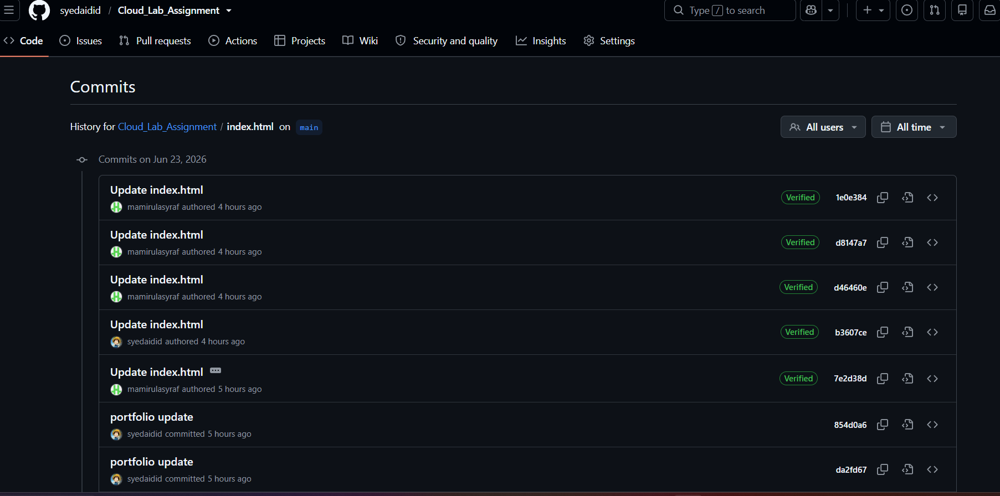
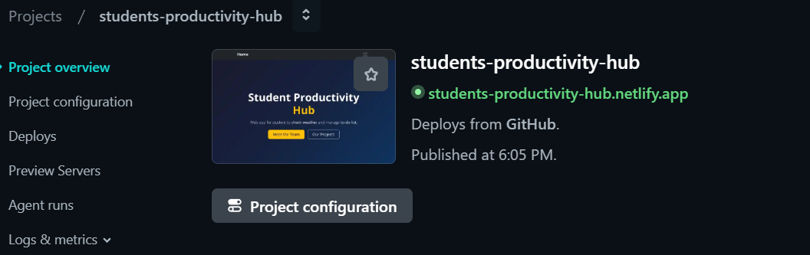
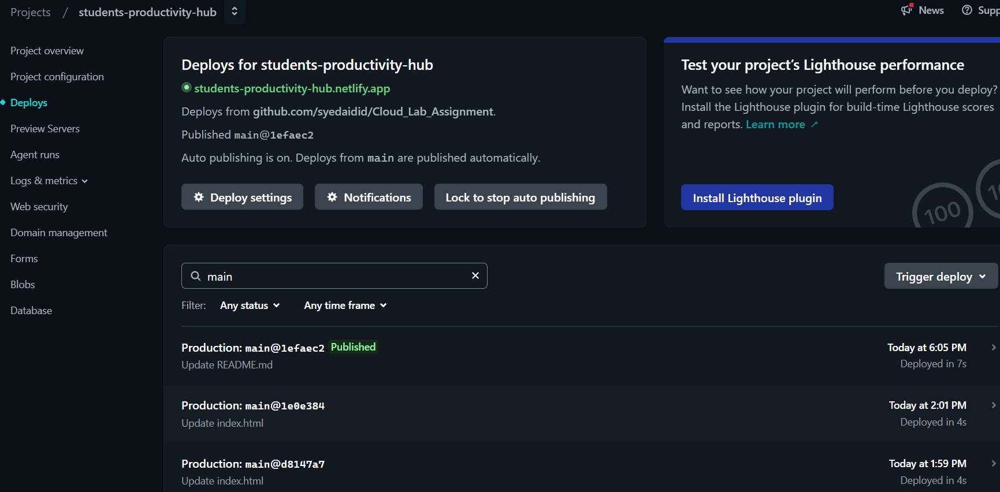

# Student Productivity Hub

A responsive, cloud-deployed static web application designed to optimize student workflows by combining key utility features into a single dashboard. This project was developed and deployed as part of the ARC4213 Cloud Computing lab assessment.

## 🌐 Live Deployment
The application is automatically compiled and hosted via Netlify's global edge network.
* **Production URL** [https://students-productivity-hub.netlify.app/](https://students-productivity-hub.netlify.app/)

---

## 👥 Meet the Team
Tasks were separated into distinct development and operational modules to ensure balanced participation and project success:

* **Syed Amer Aidid** – Team Lead and Frontend Dev
  * Responsible for project layout, initializing core boilerplate, configuring navbar routing, and designing responsive Bootstrap components.
* **Muhammad Amirul Asyraf Bin Bosri** – Cloud Specialist and Deployment Lead
  * Responsible for establishing the GitHub continuous deployment pipeline, auditing project file paths, and validating live cloud asset synchronization.
* **Nur 'Izzah Maisarah** – App Developer
  * Responsible for writing functional JavaScript logic for the To-Do feature, implementing task storage arrays, and managing localStorage hooks.
* **Hartini** – API Integration
  * Responsible for setting up the asynchronous network fetching structure, managing API endpoints, and parsing OpenWeatherMap JSON outputs.

---

## 🛠️ Application Features
The system incorporates three core features defined within the assignment scope:
1. **Portfolio Website** – An interactive showcase detailing group roles and technical responsibilities.
2. **To-Do App** – A persistent local task manager powered by JavaScript object structures and the browser's localStorage engine.
3. **Weather App** – A utility that communicates with the external OpenWeatherMap REST API via asynchronous Fetch calls to display live weather metrics.

---

## 🚀 Deployment Documentation

### 1. Version Control and Git Workflow
The deployment pipeline follows a continuous integration logic mapping local workspace directories up to the Netlify Content Delivery Network (CDN) through our shared GitHub repository.



### 2. Netlify Cloud Deployment Settings
Netlify tracks commit webhooks within our main branch. Whenever an update is pushed to GitHub, Netlify automatically triggers a new production build.



### 3. Production Build Validation
The deployment logs confirm successful compilation and asset distribution across all edge nodes.



---

## 📁 Repository Structure
```text
├── index.html       # Portfolio and Dashboard Entry Point
├── todo.html        # To-Do Feature Page
├── weather.html     # Weather Feature Page
├── css/
│   └── style.css    # Custom UI Stylesheet
└── js/
    ├── todo.js      # Task Persistence Engine
    └── weather.js   # OpenWeatherMap API Controller
